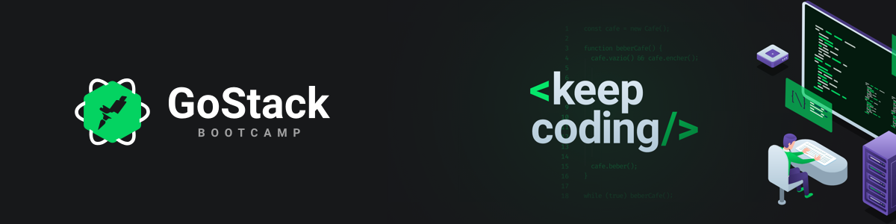

  

<h1 align="center"> Bootcamp Cursos </h1>

# Menu
- [Motivação](#trophy-motivação)
- [Cursos](#books-cursos)
- [Autor](#memo-autor)

## :trophy: Motivação
Repositório dedicado aos cursos bônus/recompensas de desafios do bootcamp GoStack da [Rocketseat](https://rocketseat.com.br").

## :books: Cursos
- [Flexbox](https://github.com/lucasfdcampos/rocketseat-bootcamp-gostack-bonus-cursos/tree/master/flexbox)
- [Redux](https://github.com/lucasfdcampos/rocketseat-bootcamp-gostack-bonus-cursos/tree/master/redux)

## :memo: Autor

&nbsp
