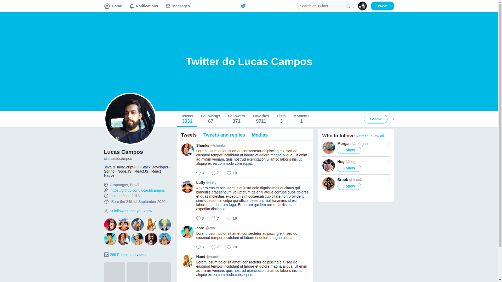

# Curso de Flexbox
> Representação de um clone do layout do Twitter 🐦 em html e css puros utilizando **Flexbox**.

<p align="center">


<p>

<h2>📌 Sobre</h2>
<p>
Curso de <b>Flexbox</b> ministrado por <a href="https://github.com/diego3g">Diego Fernandes</a>. Recompensa de desafios do Bootcamp GoStack.
<p>



<br />

<h2>📃 Como obter o layout</h2>

```bash
  # clone o repositório
  $ git clone https://github.com/lucasfdcampos/rocketseat-bootcamp-gostack-bonus-cursos.git

  # acesse o diretório
  $ cd flexbox
```

<h2>📝 Autor</h2>
<a href="https://linkedin.com/in/lucasfdcampos"></a>